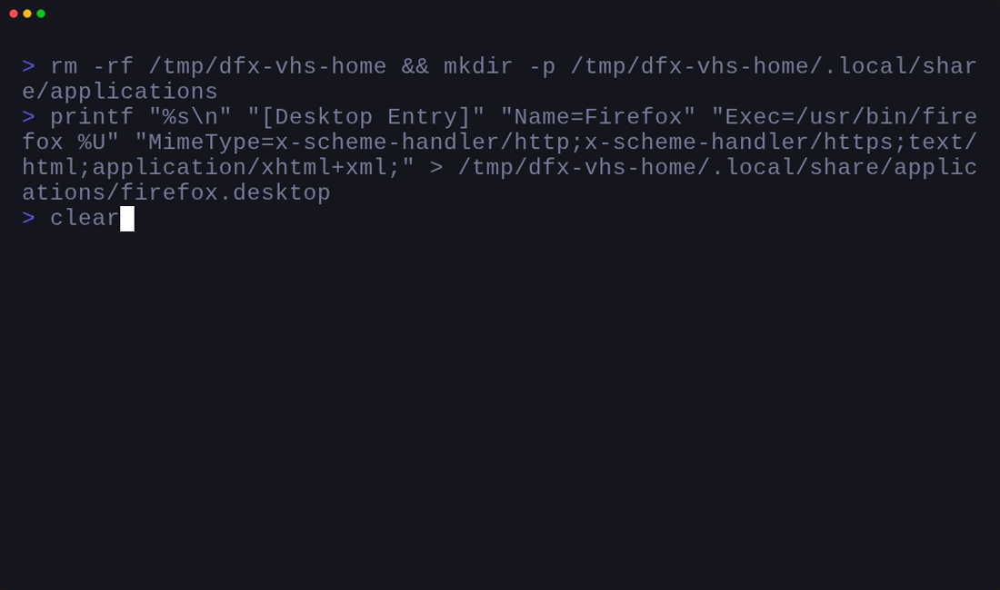

# dfx

`dfx` is a cross-platform CLI for inspecting, validating, and changing default
application associations.

Default-app state is fragmented across MIME types, URL schemes, desktop entries,
macOS bundle identifiers, Windows ProgIDs, browser settings, and enterprise
policy. `dfx` gives those platform-specific pieces one automation-friendly
interface.

## Preview

Partial app names resolve to platform identifiers before any mutation runs:


Profiles let you validate and dry-run a full default-app plan before applying it:


New `--content-type`, `--mime`, and `--scheme` targets work across all platforms:



The preview GIFs are generated with [Charm VHS](https://github.com/charmbracelet/vhs)
from the tapes in [`docs/vhs`](./docs/vhs). CI regenerates them as build
artifacts through [`previews.yml`](./.github/workflows/previews.yml).

## Install

```sh
go install github.com/LukasParke/dfx/cmd/dfx@latest
```

For local development:

```sh
go run ./cmd/dfx inspect
```

## Platform support

| Platform | Read | Write | System writes | Notes |
| --- | --- | --- | --- | --- |
| Linux | Yes | Yes | Yes (as root) | Uses `xdg-mime`; browser defaults also sync through `xdg-settings` when available. System-level writes target `/etc/xdg/mimeapps.list`. |
| macOS | Yes | Yes, backend-dependent | Guidance only | Native LaunchServices (CGO), embedded helper, `duti`, or `osascript` fallback. System defaults require MDM or System Settings. |
| Windows | Yes | Yes, policy-backed | Yes (via policy) | Writes default-association XML and configures the machine policy pointer; avoids unsafe `UserChoice` registry edits. |

Windows writes require permission to update machine policy under
`HKLM\Software\Policies\Microsoft\Windows\System`. By default, `dfx` writes the
XML to `%ProgramData%\dfx\DefaultAssociations.xml`; set
`DFX_WINDOWS_DEFAULT_ASSOCIATIONS_FILE` to choose another policy XML path.
Windows applies that policy during policy processing, usually after `gpupdate`
and the next sign-in.

## Quick start

```sh
dfx inspect
dfx get --browser
dfx get --scheme https
dfx get --content-type public.html
dfx set vivaldi --browser --dry-run
dfx doctor --browser --strict
```

`set` accepts either an exact identifier or one positional app query:

```sh
dfx set vivaldi --browser
dfx set --browser --app firefox.desktop
dfx set --mime text/html --app firefox.desktop
dfx set --scheme https://example.com/path --app firefox.desktop
dfx set --content-type public.html --app com.apple.Safari
```

System-level defaults (Linux only, requires root):

```sh
sudo dfx set --browser --app firefox.desktop --system
sudo dfx apply dfx.json --system
```

Partial app names are resolved where possible:

- Linux: installed `.desktop` entries.
- macOS: application names and known browser aliases/prefixes to bundle IDs.
- Windows: registered default-app metadata to ProgIDs.

If a query is ambiguous, use the exact platform identifier.

## Target kinds

`dfx` supports four target kinds. The platform mapping is:

| Kind | Linux | macOS | Windows |
|------|-------|-------|---------|
| `browser` | `xdg-settings` + `x-scheme-handler/http/https` + `text/html` | LaunchServices `http`/`https` + `public.html` | `http`/`https` + `.html`/`.xhtml` UserChoice |
| `mime` | Direct MIME type via `xdg-mime` | MIME → UTI via `UTType` mapping | MIME → file extension → UserChoice |
| `scheme` | `x-scheme-handler/<scheme>` | LaunchServices URL scheme | `UrlAssociations\<scheme>\UserChoice` |
| `content_type` | Alias to `mime` (must be valid MIME) | Direct UTI (`public.html`) | ProgID or `.extension` registry lookup |

`content_type` is the platform-native identifier: UTIs on macOS, ProgIDs or
file extensions on Windows, and MIME types on Linux.

## Commands

Inspect platform capability:

```sh
dfx inspect
dfx inspect --verbose
dfx inspect --json
```

Read the current handler:

```sh
dfx get --browser
dfx get --mime text/html
dfx get --scheme https
dfx get --scheme https://example.com/path
dfx get --content-type public.html
```

Diagnose defaults:

```sh
dfx doctor --browser
dfx doctor --mime text/html
dfx doctor --scheme https
dfx doctor --content-type public.html
dfx doctor --all
```

Strict mode returns non-zero for warnings. Fix mode applies safe automated
remediations for the selected scope:

```sh
dfx doctor --browser --strict
dfx doctor --browser --fix --dry-run
dfx doctor --all --fix --dry-run
dfx doctor --browser --json
```

Preflight launch routing without opening an external app by default:

```sh
dfx open-test --scheme myapp --expected com.example.App
dfx open-test --content-type public.html --expected com.apple.Safari
DFX_CALLBACK_SCHEME=myapp://oauth/callback dfx open-test --callback --expected com.example.App
dfx open-test --mime text/html --expected firefox.desktop
dfx open-test --mime text/html --path ./sample.html --expected firefox.desktop --launch
```

`open-test --launch` only runs the platform opener after resolution succeeds and
any `--expected` check passes. MIME launches require `--path` to an existing
file. Scheme, browser, and callback launches ignore `--path` and record that in
launch evidence.

## Profiles

Generate and validate a profile:

```sh
dfx profile template --app firefox.desktop > dfx.json
dfx profile template --app firefox.desktop --callback-scheme myapp --callback-app myapp.desktop
dfx profile validate dfx.json
dfx profile validate --json dfx.json
```

Example profile:

```json
{
  "defaults": [
    { "kind": "browser", "app": "firefox.desktop" },
    { "kind": "scheme", "value": "myapp", "app": "myapp.desktop" },
    { "kind": "mime", "value": "text/html", "app": "firefox.desktop" },
    { "kind": "content_type", "value": "public.html", "app": "com.apple.Safari" }
  ]
}
```

Apply it:

```sh
dfx apply --dry-run dfx.json
dfx apply --dry-run --json dfx.json
dfx apply dfx.json
```

`profile validate` and `apply` normalize schemes, reject malformed targets,
reject duplicate or browser-overlapping defaults, and expand `$VAR`, `${VAR}`,
and `%VAR%` in profile paths. `apply` validates the full profile before applying
any entry.

## Windows policy helpers

```sh
dfx windows-policy audit --prog-id ChromeHTML --callback-scheme myapp --json
dfx windows-policy backup --file ActiveDefaultAssociations.xml --dry-run
dfx windows-policy bundle --file DefaultAssociations.xml --output ./windows-policy-bundle --archive windows-policy-bundle.zip --policy-path 'C:\ProgramData\dfx\DefaultAssociations.xml'
dfx windows-policy bundle --profile dfx.json --resolve-apps --output ./windows-policy-bundle --gpo-name "Default App Policy" --link-target 'OU=Workstations,DC=example,DC=com'
dfx windows-policy bundle --delete --output ./windows-policy-removal --archive windows-policy-removal.zip --gpo-name "Default App Policy"
dfx windows-policy bundle-inspect --path ./windows-policy-bundle --json
dfx windows-policy bundle-inspect --archive windows-policy-bundle.zip --json
dfx windows-policy compile --profile dfx.json --file DefaultAssociations.xml --callback-scheme myapp --resolve-apps --suggested --version 2026.05.30
dfx windows-policy csp --file DefaultAssociations.xml --syncml
dfx windows-policy csp --profile dfx.json --suggested --version 2026.05.30 --syncml
dfx windows-policy csp --delete --syncml
dfx windows-policy deploy --profile dfx.json --file DefaultAssociations.xml --gpupdate --dry-run
dfx windows-policy diff --file DefaultAssociations.xml --json
dfx windows-policy export --file DefaultAssociations.xml --callback-scheme myapp
dfx windows-policy gpo --gpo-name "Default App Policy" --policy-path '\\fileserver\share\DefaultAssociations.xml'
dfx windows-policy gpo --gpo-name "Default App Policy" --policy-path '\\fileserver\share\DefaultAssociations.xml' --create --link-target 'OU=Workstations,DC=example,DC=com' --enforced
dfx windows-policy gpo-backup --gpo-name "Default App Policy" --path 'C:\GPOBackups' --comment "Before dfx default-app update"
dfx windows-policy gpo-restore --gpo-name "Default App Policy" --path 'C:\GPOBackups\\DefaultAppPolicy'
dfx windows-policy gpo-report --gpo-name "Default App Policy" --format html --file GPOReport.html
dfx windows-policy gpo-status --gpo-name "Default App Policy" --json
dfx windows-policy gpresult --scope computer --format html --file gpresult.html --force
dfx windows-policy gpresult --scope computer --format summary --json
dfx windows-policy import --file DefaultAssociations.xml --dry-run
dfx windows-policy invoke-refresh --computer WORKSTATION01 --target computer --random-delay 0 --force
dfx windows-policy invoke-refresh --computer WORKSTATION01 --target computer --random-delay 0 --force --script
dfx windows-policy intune --file DefaultAssociations.xml --name "Windows default apps"
dfx windows-policy intune --profile dfx.json --resolve-apps --suggested --version 2026.05.30 --json
dfx windows-policy list
dfx windows-policy lgpo --policy-path 'C:\ProgramData\dfx\DefaultAssociations.xml'
dfx windows-policy merge --file DefaultAssociations.xml --prog-id ChromeHTML --browser --callback-scheme myapp
dfx windows-policy normalize --file DefaultAssociations.xml --output NormalizedAssociations.xml --dry-run
dfx windows-policy pol --policy-path 'C:\ProgramData\dfx\DefaultAssociations.xml' --output Registry.pol
dfx windows-policy profile --file DefaultAssociations.xml
dfx windows-policy registered --query chrome --json
dfx windows-policy refresh --target computer --force --wait 600
dfx windows-policy reg --policy-path 'C:\ProgramData\dfx\DefaultAssociations.xml'
dfx windows-policy remove --dry-run
dfx windows-policy restore --file ActiveDefaultAssociations.xml --gpupdate --dry-run
dfx windows-policy script --file DefaultAssociations.xml --gpupdate
dfx windows-policy status --callback-scheme myapp --json
dfx windows-policy targets --callback-scheme myapp
dfx windows-policy validate --file DefaultAssociations.xml --json
dfx windows-policy template --prog-id ChromeHTML --application-name Chrome --callback-scheme myapp
dfx windows-policy install --file DefaultAssociations.xml --gpupdate --dry-run
dfx windows-policy uninstall --gpupdate --dry-run
```

These commands audit ProgIDs, back up or restore active policy XML, build
self-contained deployment bundles, compile or deploy dfx profiles as policy XML,
generate ApplicationDefaults CSP payloads for MDM/Intune-style rollout, compare
desired policy to installed/current policy, export/import/list/remove DISM
default associations, collect GPO reports and gpresult Group Policy evidence, merge browser/protocol/MIME records into XML, discover
registered Windows applications and ProgIDs, normalize policy XML into stable
reviewable form, convert policy XML back into dfx profiles, generate offline
domain GPO, Registry.pol, `.reg`, LGPO text, and PowerShell artifacts for the
policy pointer, inspect the installed policy pointer, validate, generate, or install
enterprise default-association XML without editing protected `UserChoice` state.
Validation covers required browser targets (`http`, `https`, `text/html`,
`application/xhtml+xml`) and optional callback schemes.
Use `windows-policy targets` to inspect the target-to-XML-identifier coverage
that validation and generated browser policy XML expect.
Use `windows-policy profile --file <xml>` to convert Windows policy XML back
into a dfx profile for review or cross-platform source control.
Use `windows-policy bundle --file <xml> --output <dir>` to package reviewed XML
with `.reg`, LGPO text, `Registry.pol`, local PowerShell, SyncML, Intune JSON,
manifest, and operator notes. Add GPO flags such as `--gpo-name` and
`--link-target` to include a domain GPO script in the same bundle. Add
`--archive <zip>` when change-control or deployment tooling expects one
portable archive.
Use `windows-policy bundle --delete --output <dir>` to package matching removal
artifacts: registry delete, LGPO delete, `Registry.pol` delete, CSP Delete
SyncML, local removal PowerShell, optional domain GPO removal, manifest, and
operator notes.
Use `windows-policy gpo-restore --gpo-name <name> --path <path> [--what-if]` to
restore an existing domain GPO backup directory with a reviewed `Restore-GPO`
PowerShell artifact.
Use `windows-policy bundle-inspect --path <dir>` or `--archive <zip>` to inspect
bundle completeness, manifest type, required artifacts, and bundled deployment
XML validity. It exits non-zero for incomplete or invalid bundles.

For `windows-policy compile`, profile `app` values are treated as Windows
ProgIDs so the output is deterministic and can be generated offline.
On a representative Windows machine, add `--resolve-apps` to `compile`,
`deploy`, or `csp --profile` to resolve profile app queries through registered
application metadata before generating policy.
`windows-policy deploy` performs compile plus install in one step, with
`--dry-run` showing the planned XML and policy operations before anything is
written.
`windows-policy csp` validates XML, base64-encodes it for the documented
ApplicationDefaults CSP, and can emit SyncML `Replace` or `Delete` payloads with
`--syncml`. It can also compile a profile directly with `--profile`, treating
profile `app` values as Windows ProgIDs.
`windows-policy intune` emits the same ApplicationDefaults payload as an Intune
custom OMA-URI setting: name, description, OMA-URI, data type, and base64 value.
Use it when the deployment channel is Intune rather than raw SyncML.
For Windows 11 22H2+ policy timing controls, use `--suggested` to emit
`Suggested="true"` associations and `--version` to set the root
`DefaultAssociations Version` value. Incrementing the version is how Windows
re-applies suggested associations.
Validation, status, and diff output expose the detected root `Version` and
whether any associations are marked suggested, so automation can reason about
mandatory vs one-time policy behavior.
`windows-policy import`, `list`, and `remove` use DISM servicing commands for
online or offline Windows images; imported associations apply during each user's
first logon rather than by rewriting existing per-user `UserChoice` values.

Normal `dfx set` and `dfx apply` on Windows use the same policy-backed model:
they merge target associations into the configured XML file and set the
documented `DefaultAssociationsConfiguration` machine policy value. They do not
write hash-protected per-user `UserChoice` keys.

Use `windows-policy install --destination <path>` to place a reviewed XML file
at a specific policy location, and add `--gpupdate` to request
`gpupdate /target:computer /force` after installation. Without `--destination`, `dfx` uses
`DFX_WINDOWS_DEFAULT_ASSOCIATIONS_FILE` when set, then falls back to
`%ProgramData%\dfx\DefaultAssociations.xml`.
Use `windows-policy lgpo --policy-path <xml>` when the deployment channel
expects LGPO text. The output targets Computer Configuration and can be applied
with `LGPO.exe /t <file>` by tooling that already carries Microsoft's LGPO
utility.
Use `windows-policy pol --output Registry.pol --policy-path <xml>` when the
deployment channel expects a machine `Registry.pol` artifact directly. Without
`--output`, the command returns base64 content for packaging systems.
Use `windows-policy gpo --gpo-name <name> --policy-path <xml>` when the
deployment target is an Active Directory domain GPO. The generated PowerShell
uses the GroupPolicy module's `Set-GPRegistryValue` cmdlet; for real fleets the
XML path should normally be a UNC path reachable by target computers.
Add `--create` to include a `New-GPO` step, and add `--link-target <DN>` to
include a `New-GPLink` step for a site, domain, or OU distinguished name.
`--link-disabled`, `--enforced`, and `--order` expose the common link controls.
Use `windows-policy gpo-backup --gpo-name <name> --path <dir>` before changing
a domain GPO. It wraps `Backup-GPO`; `--script`, `--output`, `--dry-run`, and
`--what-if` support reviewed change workflows.
Use `windows-policy gpo-report --gpo-name <name> --format html --file <path>`
to generate a domain GPO settings report with `Get-GPOReport` before or after
rollout. Use `--script` or `--output` for reviewed PowerShell artifacts.
Use `windows-policy gpo-status --gpo-name <name>` to read the configured
`DefaultAssociationsConfiguration` registry policy value from a domain GPO with
`Get-GPRegistryValue`.
Use `windows-policy gpresult` on target machines after rollout to collect
computer-scope Resultant Set of Policy evidence. `--format html --file <path>`
writes a reviewable report; `--format summary` prints command output.
Use `windows-policy refresh --target computer --force` to run `gpupdate` as an
explicit post-deployment step. `--wait`, `--logoff`, `--boot`, and `--sync`
map directly to the documented `gpupdate` lifecycle controls.
Use `windows-policy invoke-refresh --computer <host> --random-delay 0 --force`
from an admin workstation with the GroupPolicy module when refresh needs to be
scheduled remotely with `Invoke-GPUpdate`. Add `--script` or `--output` to
produce a reviewed PowerShell artifact instead of running it immediately.
Use `windows-policy restore --file <backup.xml>` to install a previously backed
up policy payload through the same validation and policy-pointer flow.
Use `windows-policy uninstall` to remove the machine policy pointer. Add
`--delete-file` only when you also want to remove the XML file that policy
points to.

## JSON and exit behavior

`--json` and `-json` work before the command or inside command arguments:

```sh
dfx --json inspect --verbose
dfx inspect --json --verbose
dfx --json set --scheme https --json=false
```

Boolean forms such as `--json=0`, `--json=1`, `-json=0`, and `-json=1` are
accepted. Command-local `--json=false` overrides a root-level JSON flag.

Malformed arguments return exit code `2`. Runtime/provider failures return
non-zero and preserve any available operation plan. JSON errors include an
`error` field plus a `status` object with the intended exit code. Mutation
commands include `changed` and `dry_run` metadata.

## Development

Run the full local verification gate:

```sh
GOCACHE=/tmp/dfx-go-cache go test -timeout=60s ./...
GOCACHE=/tmp/dfx-go-cache go vet ./...
```

Cross-compile package test binaries:

```sh
GOCACHE=/tmp/dfx-go-cache GOOS=darwin go test -c -o /tmp/dfx-cli-darwin.test ./internal/cli
GOCACHE=/tmp/dfx-go-cache GOOS=windows go test -c -o /tmp/dfx-cli-windows.test.exe ./internal/cli
```

Regenerate README previews:

```sh
go install github.com/charmbracelet/vhs@latest
bash scripts/generate-previews.sh
```

VHS rendering requires `ttyd`, `ffmpeg`, and a Chromium-compatible browser on
the host. The CI preview workflow installs `ttyd`, runs the tapes, and uploads
the generated GIFs as artifacts.

## macOS write backends

macOS writes use a cascading fallback chain:

1. **Native LaunchServices (CGO)** — fastest, requires CGO-enabled build.
2. **Embedded helper** — subprocess binary wrapping `LSSetDefaultHandlerForURLScheme`
   and `LSSetDefaultRoleHandlerForContentType`. Built separately and embedded via
   `//go:embed` for non-CGO builds.
3. **`duti`** — CLI fallback (`brew install duti`).
4. **`osascript`** — final fallback for URL schemes only; requires Accessibility
   permissions and is slower than native calls.

Run `dfx inspect` to see which backends are available on your build.

## System-level writes

Linux system-level writes (`--system`) require root and write directly to
`/etc/xdg/mimeapps.list`, then run `update-desktop-database` and
`update-mime-database`.

macOS system defaults are not modifiable via CLI; `dfx` returns guidance
explaining that MDM or System Settings are the supported channels.

Windows system-level defaults are already policy-backed through the
`DefaultAssociationsConfiguration` machine policy.

## Design principles

- Prefer platform-supported APIs and commands over brittle file edits.
- Make unsupported behavior explicit instead of silently doing partial work.
- Treat URL schemes, MIME handlers, browser defaults, and callback schemes as
  first-class automation targets.
- Make mutation operations inspectable and dry-runnable before changing state.
- Keep the CLI stable while platform adapters grow underneath it.

## Research wiki

- [Default Applications Wiki](./docs/wiki/README.md)
- [Remediation Guide](./docs/wiki/remediation-guide.md)
